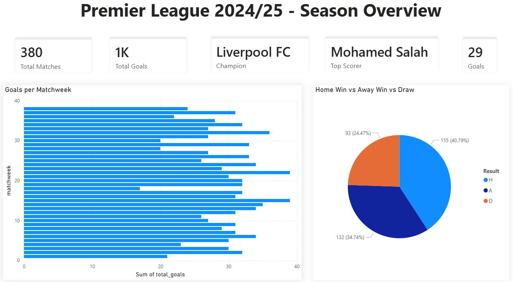
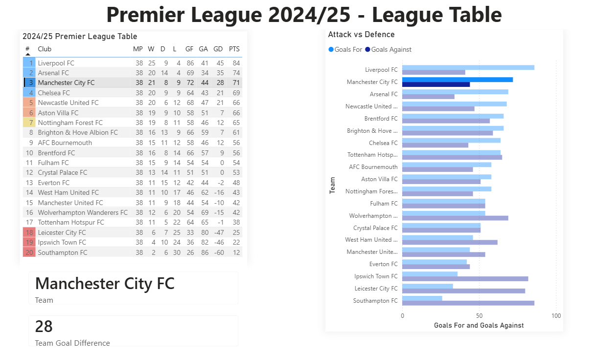
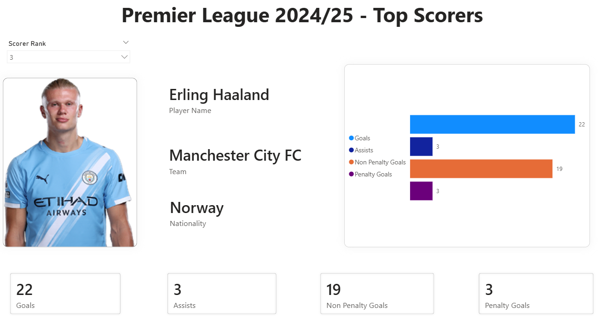

# Premier League Analytics Using AWS and Power BI

> End-to-end data engineering project — AWS + Power BI | Season 2024/25


---

## Overview

An automated data pipeline that fetches Premier League 2024/25 data from a public API [football-data.org](https://www.football-data.org), processes and stores it on AWS, and visualizes it through an interactive Power BI dashboard.

---

## Tech Stack

| Service | Purpose |
|---|---|
| AWS Lambda | Fetch API data, build CSVs, upload to S3 |
| Amazon S3 | Store raw CSVs in partitioned folders |
| AWS Glue Crawler | Auto-catalog S3 data into queryable tables |
| Amazon Athena | SQL queries over the cataloged data |
| Power BI Desktop | Interactive dashboard via ODBC connection |

---

## Dataset

4 CSV files stored in S3:

```
s3://your-bucket/premier-league/
    matches/matches.csv        
    standings/standings.csv    
    scorers/scorers.csv        
    teams/teams.csv            
```

| File | Key Columns |
|---|---|
| matches.csv | match_id, matchweek, date, home_team, away_team, home_goals_ft, away_goals_ft, result, referee |
| standings.csv | standing_type, position, team, played, won, drawn, lost, goals_for, goals_against, points, form |
| scorers.csv | rank, player_name, nationality, team, goals, assists, penalties, non_pen_goals |
| teams.csv | team_name, tla, stadium, founded, colors, coach_name, coach_nationality |

---

## Setup

### Prerequisites
- AWS account (Free Tier is enough)
- [football-data.org](https://www.football-data.org) API key (free)
- Power BI Desktop
- Simba Athena [ODBC Driver](https://docs.aws.amazon.com/athena/latest/ug/connect-with-odbc.html), you can watch [this](https://www.youtube.com/watch?v=-NLTZlCkgvw&t=1741s) video for odbc setup 

### Step 1 — S3 Bucket
1. Create an S3 bucket
2. Create folder `premier-league/` inside it
3. Create folder `athena-results/` for Athena query output

### Step 2 — Lambda Function
1. AWS Lambda → Create function → Python 3.12
2. Paste `lambda_function.py` → handler
3. Set environment variables:
   ```
   API_KEY   = your_football_data_api_key
   S3_BUCKET = your_bucket_name
   ```
4. Add layer: `AWSSDKPandas-Python312` to support requests and pandas
5. Timeout: **3 minutes** (Configuration → General)
6. IAM role: attach `AmazonS3FullAccess` + `AWSGlueServiceRole`

### Step 4 — Glue Crawler
1. AWS Glue → Crawlers → Create crawler
2. Data source: `s3://your-bucket/premier-league/`
3. Output database: `premier_league_db`
4. Run manually once to build the initial catalog

### Step 4 — Athena
1. Athena → Settings → query results: `s3://your-bucket/athena-results/`
2. Select database: `premier_league_db`
3. Run a test query to verify tables

### Step 5 — Power BI
1. Install Simba Athena ODBC Driver
2. Configure ODBC with AWS credentials + S3 output path
3. Power BI → Get Data → ODBC → select Athena DSN
4. Import all 4 tables and open `dashboard/pl_dashboard.pbix`

---

## Dashboard

3 pages:

**Page 1 — Season Overview**
Cards for total matches, total goals, top scorer name & goals | Bar chart: goals per gameweek | Pie chart: home win vs away win vs draw


**Page 2 — League Table**
Full standings table with zone coloring | Cards for selected team + GD with conditional color | Bar chart: goals for vs goals against


**Page 3 — Top Scorers**
Rank slicer | Player image | Info cards: name, team, nationality | Stacked bar: goals, assists, non-pen goals, penalties


---

## Repository Structure

```
Premier-League-Analytics-Using-AWS-and-Power-BI/
├── dashboard/
│   ├── pl_dashboard.pbix
│   ├── dashboard_page1.png
│   ├── dashboard_page2.png
│   ├── dashboard_page3.png
├── data/
│   ├── matches.csv
│   ├── scorers.csv
│   ├── standings.csv
│   ├── teams.csv
├── images/
│   ├── project_architecture.png
├── lambda_function.py
└── README.md
```
